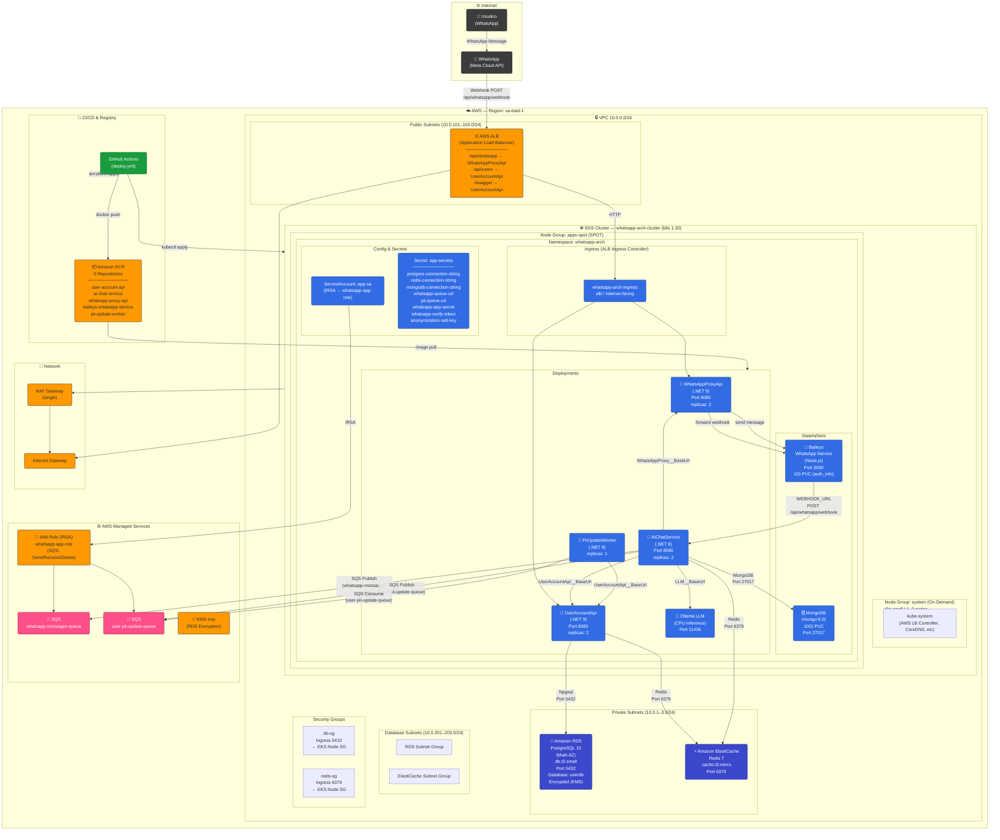
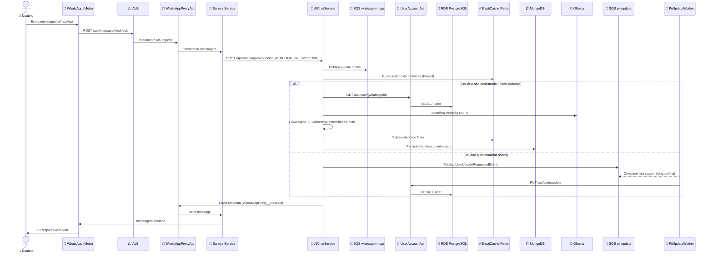
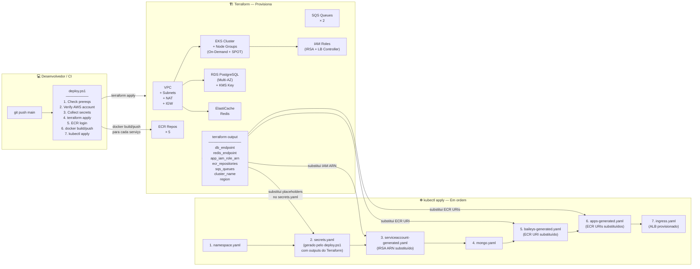
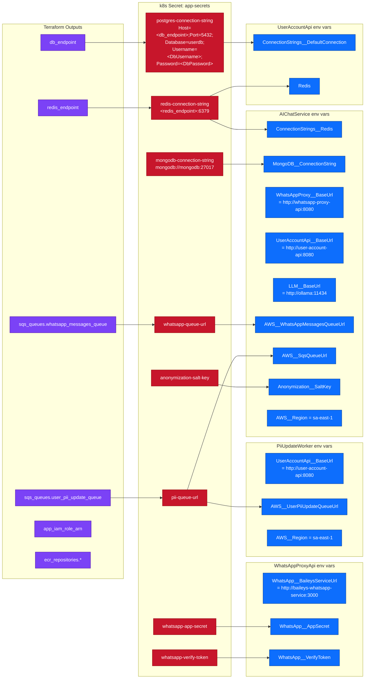

# Arquitetura AWS — WhatsApp Registration System

Diagramas da arquitetura completa do sistema após deploy via Terraform + Kubernetes (EKS) na AWS.

---

## 1. Visão Geral — Infraestrutura AWS (Terraform)

---

## 2. Fluxo de Mensagem (Sequência)

---

## 3. Pipeline de Deploy (Terraform + k8s)

---

## 4. Mapa de Configurações (Env Vars → Secrets)

