# Arquitetura AWS — WhatsApp Registration System

Diagramas da arquitetura completa do sistema após deploy via Terraform + Kubernetes (EKS) na AWS.

---

## 1. Visão Geral — Infraestrutura AWS (Terraform)

```mermaid
graph TB
    subgraph INTERNET["🌐 Internet"]
        WA["📱 WhatsApp\n(Meta Cloud API)"]
        USER["👤 Usuário\n(WhatsApp)"]
    end

    subgraph AWS["☁️ AWS — Region: sa-east-1"]

        subgraph CICD["🔧 CI/CD & Registry"]
            GHA["GitHub Actions\n(deploy.yml)"]
            ECR["📦 Amazon ECR\n5 Repositórios\n─────────────\nuser-account-api\nai-chat-service\nwhatsapp-proxy-api\nbaileys-whatsapp-service\npii-update-worker"]
        end

        subgraph VPC["🔒 VPC  10.0.0.0/16"]

            subgraph PUBLIC["Public Subnets (10.0.101–103.0/24)"]
                ALB["⚖️ AWS ALB\n(Application Load Balancer)\n─────────────\n/api/whatsapp → WhatsAppProxyApi\n/api/users → UserAccountApi\n/swagger → UserAccountApi"]
            end

            subgraph EKS_CLUSTER["☸️ EKS Cluster — whatsapp-arch-cluster (k8s 1.30)"]

                subgraph SYS_NG["Node Group: system (On-Demand)\nt3a.small | 1–2 nodes"]
                    KUBE_SYS["kube-system\n(AWS LB Controller, CoreDNS, etc)"]
                end

                subgraph APP_NG["Node Group: apps-spot (SPOT)\nt3.medium / t3a.medium | 2–5 nodes"]

                    subgraph NS["Namespace: whatsapp-arch"]
                        direction TB

                        subgraph INGRESS_K8S["Ingress (ALB Ingress Controller)"]
                            ING["whatsapp-arch-ingress\nalb / internet-facing"]
                        end

                        subgraph STATEFUL["StatefulSets"]
                            MONGO["🗄️ MongoDB\n(mongo:6.0)\n10Gi PVC\nPort 27017"]
                            BAILEYS["📡 Baileys\nWhatsApp Service\n(Node.js)\nPort 3000\n1Gi PVC (auth_info)"]
                        end

                        subgraph DEPLOYMENTS["Deployments"]
                            WP_API["🔀 WhatsAppProxyApi\n(.NET 9)\nPort 8080\nreplicas: 2"]
                            UA_API["👤 UserAccountApi\n(.NET 9)\nPort 8080\nreplicas: 2"]
                            AI_SVC["🤖 AIChatService\n(.NET 9)\nPort 8080\nreplicas: 2"]
                            PII_W["🔐 PiiUpdateWorker\n(.NET 9)\nreplicas: 1"]
                            OLLAMA["🧠 Ollama LLM\n(CPU inference)\nPort 11434"]
                        end

                        subgraph CONFIG["Config & Secrets"]
                            SA["ServiceAccount: app-sa\n(IRSA → whatsapp-app-role)"]
                            SECRETS["Secret: app-secrets\n─────────────\npostgres-connection-string\nredis-connection-string\nmongodb-connection-string\nwhatsapp-queue-url\npii-queue-url\nwhatsapp-app-secret\nwhatsapp-verify-token\nanonymization-salt-key"]
                        end
                    end
                end
            end

            subgraph PRIVATE["Private Subnets (10.0.1–3.0/24)"]
                direction TB
                RDS["🐘 Amazon RDS\nPostgreSQL 15\n(Multi-AZ)\ndb.t3.small\nPort 5432\nDatabase: userdb\nEncrypted (KMS)"]
                REDIS["⚡ Amazon ElastiCache\nRedis 7\ncache.t3.micro\nPort 6379"]
            end

            subgraph DB_SUBNETS["Database Subnets (10.0.201–203.0/24)"]
                direction LR
                RDS2["RDS Subnet Group"]
                REDIS2["ElastiCache Subnet Group"]
            end

            subgraph SG["Security Groups"]
                DB_SG["db-sg\nIngress 5432\n← EKS Node SG"]
                REDIS_SG["redis-sg\nIngress 6379\n← EKS Node SG"]
            end
        end

        subgraph MANAGED["⚙️ AWS Managed Services"]
            SQS_WA["📨 SQS\nwhatsapp-messages-queue"]
            SQS_PII["📨 SQS\nuser-pii-update-queue"]
            IAM_IRSA["🔑 IAM Role (IRSA)\nwhatsapp-app-role\n(SQS: Send/Receive/Delete)"]
            KMS["🔐 KMS Key\n(RDS Encryption)"]
        end

        subgraph GATEWAY["🚪 Network"]
            NAT["NAT Gateway\n(single)"]
            IGW["Internet Gateway"]
        end
    end

    %% External flows
    USER -- "WhatsApp Message" --> WA
    WA -- "Webhook POST\n/api/whatsapp/webhook" --> ALB
    ALB -- "HTTP" --> ING
    ING --> WP_API
    ING --> UA_API

    %% Internal k8s flows
    WP_API -- "forward webhook" --> BAILEYS
    BAILEYS -- "WEBHOOK_URL\nPOST /api/whatsapp/webhook" --> AI_SVC
    AI_SVC -- "WhatsAppProxy__BaseUrl" --> WP_API
    WP_API -- "send message" --> BAILEYS
    AI_SVC -- "UserAccountApi__BaseUrl" --> UA_API
    AI_SVC -- "LLM__BaseUrl" --> OLLAMA
    PII_W -- "UserAccountApi__BaseUrl" --> UA_API

    %% AWS Managed
    AI_SVC -- "SQS Publish\n(whatsapp-messages-queue)" --> SQS_WA
    AI_SVC -- "SQS Publish\n(user-pii-update-queue)" --> SQS_PII
    PII_W -- "SQS Consume\n(user-pii-update-queue)" --> SQS_PII

    %% Data stores
    UA_API -- "Npgsql\nPort 5432" --> RDS
    UA_API -- "Redis\nPort 6379" --> REDIS
    AI_SVC -- "Redis\nPort 6379" --> REDIS
    AI_SVC -- "MongoDB\nPort 27017" --> MONGO

    %% IAM
    SA -- "IRSA" --> IAM_IRSA
    IAM_IRSA --> SQS_WA
    IAM_IRSA --> SQS_PII

    %% Network
    ALB --> IGW
    EKS_CLUSTER --> NAT
    NAT --> IGW

    %% CI/CD
    GHA -- "docker push" --> ECR
    GHA -- "terraform apply" --> AWS
    GHA -- "kubectl apply" --> EKS_CLUSTER
    ECR -- "image pull" --> DEPLOYMENTS

    classDef aws fill:#FF9900,stroke:#232F3E,color:#232F3E,rx:4
    classDef k8s fill:#326CE5,stroke:#1a3f8f,color:#fff,rx:4
    classDef db fill:#3B48CC,stroke:#1a2575,color:#fff,rx:4
    classDef sqs fill:#FF4F8B,stroke:#B0003A,color:#fff,rx:4
    classDef green fill:#1A9C3E,stroke:#0d5c24,color:#fff,rx:4
    classDef gray fill:#3C3C3C,stroke:#111,color:#fff,rx:4

    class ECR,IAM_IRSA,KMS,NAT,IGW,ALB aws
    class WP_API,UA_API,AI_SVC,PII_W,OLLAMA,MONGO,BAILEYS,ING,SA,SECRETS k8s
    class RDS,REDIS db
    class SQS_WA,SQS_PII sqs
    class GHA green
    class WA,USER gray
```

---

## 2. Fluxo de Mensagem (Sequência)

```mermaid
sequenceDiagram
    actor U as 👤 Usuário
    participant WA as 📱 WhatsApp (Meta)
    participant ALB as ⚖️ ALB
    participant WPA as 🔀 WhatsAppProxyApi
    participant BWS as 📡 Baileys Service
    participant AIC as 🤖 AIChatService
    participant SQS_WA as 📨 SQS whatsapp-msgs
    participant UAA as 👤 UserAccountApi
    participant RDS as 🐘 RDS PostgreSQL
    participant REDIS as ⚡ ElastiCache Redis
    participant MONGO as 🗄️ MongoDB
    participant LLM as 🧠 Ollama
    participant SQS_PII as 📨 SQS pii-update
    participant PII as 🔐 PiiUpdateWorker

    U->>WA: Envia mensagem WhatsApp
    WA->>ALB: POST /api/whatsapp/webhook
    ALB->>WPA: roteamento via Ingress
    WPA->>BWS: forward da mensagem
    BWS->>AIC: POST /api/whatsapp/webhook\n(WEBHOOK_URL interno k8s)

    AIC->>SQS_WA: Publica evento na fila
    AIC->>REDIS: Busca estado da conversa (FlowId)

    alt Usuário não cadastrado / novo cadastro
        AIC->>UAA: GET /api/user/{whatsappId}
        UAA->>RDS: SELECT user
        AIC->>LLM: Identifica intenção (NLP)
        AIC->>AIC: FlowEngine → CollectingName/Phone/Email...
        AIC->>REDIS: Salva estado do fluxo
        AIC->>MONGO: Persiste histórico anonimizado
    else Usuário quer atualizar dados
        AIC->>SQS_PII: Publica UserUpdateRequestedEvent
        PII-->>SQS_PII: Consome mensagem (long polling)
        PII->>UAA: PUT /api/user/update
        UAA->>RDS: UPDATE user
    end

    AIC->>WPA: Envia resposta (WhatsAppProxy__BaseUrl)
    WPA->>BWS: send message
    BWS->>WA: mensagem enviada
    WA->>U: 💬 Resposta recebida
```

---

## 3. Pipeline de Deploy (Terraform + k8s)

```mermaid
flowchart LR
    subgraph DEV["💻 Desenvolvedor / CI"]
        CODE["git push main"]
        PS1["deploy.ps1\n─────────\n1. Check prereqs\n2. Verify AWS account\n3. Collect secrets\n4. terraform apply\n5. ECR login\n6. docker build/push\n7. kubectl apply"]
    end

    subgraph TF["🏗️ Terraform — Provisiona"]
        VPC_TF["VPC\n+ Subnets\n+ NAT\n+ IGW"]
        EKS_TF["EKS Cluster\n+ Node Groups\n(On-Demand + SPOT)"]
        RDS_TF["RDS PostgreSQL\n(Multi-AZ)\n+ KMS Key"]
        REDIS_TF["ElastiCache\nRedis"]
        SQS_TF["SQS Queues\n× 2"]
        ECR_TF["ECR Repos\n× 5"]
        IAM_TF["IAM Roles\n(IRSA + LB Controller)"]
        OUT["terraform output\n─────────────\ndb_endpoint\nredis_endpoint\napp_iam_role_arn\necr_repositories\nsqs_queues\ncluster_name\nregion"]
    end

    subgraph K8S["☸️ kubectl apply — Em ordem"]
        NS_K["1. namespace.yaml"]
        SEC_K["2. secrets.yaml\n(gerado pelo deploy.ps1\ncom outputs do Terraform)"]
        SA_K["3. serviceaccount-generated.yaml\n(IRSA ARN substituído)"]
        MG_K["4. mongo.yaml"]
        BW_K["5. baileys-generated.yaml\n(ECR URI substituído)"]
        AP_K["6. apps-generated.yaml\n(ECR URIs substituídos)"]
        IN_K["7. ingress.yaml\n(ALB provisionado)"]
    end

    CODE --> PS1
    PS1 -->|"terraform apply"| TF
    VPC_TF --> EKS_TF
    VPC_TF --> RDS_TF
    VPC_TF --> REDIS_TF
    EKS_TF --> IAM_TF
    TF --> OUT
    OUT -->|"substitui placeholders\nno secrets.yaml"| SEC_K
    OUT -->|"substitui IAM ARN"| SA_K
    OUT -->|"substitui ECR URIs"| AP_K
    OUT -->|"substitui ECR URI"| BW_K
    PS1 -->|"docker build/push\npara cada serviço"| ECR_TF
    NS_K --> SEC_K --> SA_K --> MG_K --> BW_K --> AP_K --> IN_K
```

---

## 4. Mapa de Configurações (Env Vars → Secrets)

