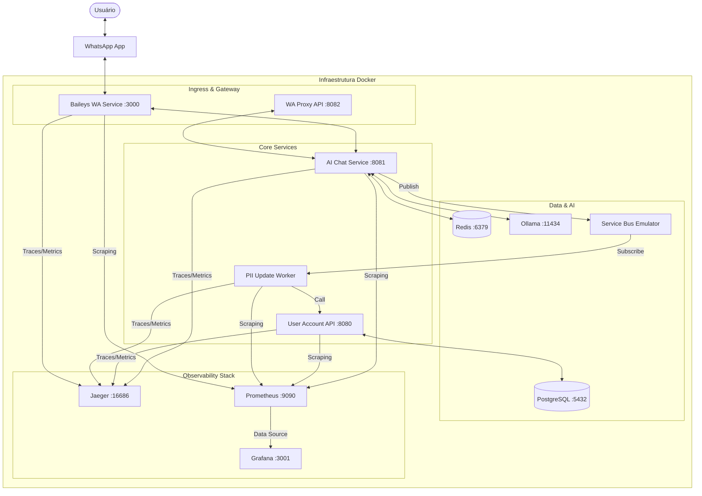

# WhatsApp Registration System

Sistema inteligente de registro e atualização de dados de usuários via WhatsApp, construído com arquitetura de microserviços moderna usando **.NET 9** e **Node.js**, totalmente containerizado e monitorado.

## 📋 Visão Geral

Este projeto implementa um sistema de atendimento automatizado que permite aos usuários registrar e atualizar suas informações pessoais (PII) através de linguagem natural no WhatsApp. O sistema utiliza modelos de IA locais para processamento e uma infraestrutura robusta de observabilidade.

### Fluxo Principal

1.  **Usuário** envia mensagem via WhatsApp.
2.  **Baileys WhatsApp Service** (Node.js) ou **Proxy API** (.NET) recebe a mensagem.
3.  **AI Chat Service** (.NET 9) processa a interação:
    -   Identifica intenções usando **LLM (Ollama/Phi3)**.
    -   Mantém o estado da conversa no **Redis**.
    -   Valida dados coletados (Email, Telefone, Endereço).
4.  **Event Bus** (Azure Service Bus) propaga eventos de atualização.
5.  **PII Update Worker** consome os eventos e sincroniza com a **User Account API**.
6.  **User Account API** persiste os dados no **PostgreSQL**.

---

## 🏗️ Arquitetura do Sistema



---

## 🚀 Tecnologias Utilizadas

### Backend & Core
-   **.NET 9** - Plataforma principal para serviços de alta performance.
-   **Node.js** - Utilizado no `BaileysWhatsAppService` para integração de baixo nível com WhatsApp.
-   **C# / JavaScript** - Linguagens utilizadas.
-   **Entity Framework Core** - ORM para PostgreSQL.

### Dados & Mensageria
-   **PostgreSQL 15** - Armazenamento persistente de usuários.
-   **Redis** - Cache de alta velocidade para estado de sessão (State Machine).
-   **Azure Service Bus Emulator** - Broker de mensagens para desacoplamento de serviços.

### Inteligência Artificial
-   **Ollama** - Runtime para execução de LLMs locais.
-   **Phi3** - Modelo de linguagem leve e eficiente para classificação de intenções.

### 📊 Observabilidade (Full Stack)
-   **OpenTelemetry** - Padrão utilizado para instrumentação de logs, métricas e traces.
-   **Jaeger** - Visualização de Distributed Tracing (rastreamento fim-a-fim de mensagens).
-   **Prometheus** - Coleta e armazenamento de métricas de performance (CPU, Memória, Requests).
-   **Grafana** - Dashboards interativos para monitoramento do sistema.

---

## 📁 Estrutura do Projeto

```text
full_architecture/
├── src/
│   ├── AIChatService/          # Cérebro do sistema (Flow Engine + LLM)
│   ├── BaileysWhatsAppService/ # Integração WhatsApp via Node.js (QR Code)
│   ├── WhatsAppProxyApi/       # Proxy para Meta Cloud API (.NET)
│   ├── UserAccountApi/         # Gestão de perfis de usuário
│   ├── PiiUpdateWorker/        # Processamento assíncrono de eventos
│   └── Shared/                 # Telemetria e contratos compartilhados
├── grafana/                    # Configurações e Dashboards do Grafana
├── prometheus.yml              # Configuração de coleta de métricas
├── docker-compose.yml          # Orquestração principal
└── docker-compose.monitoring.yml # Stack de observabilidade
```

---

## 🔧 Como Executar

### Pré-requisitos
-   Docker Desktop configurado com **WSL2** (recomendado para performance de IA).
-   Pelo menos 8GB de RAM disponível (para rodar o modelo Phi3).

### Passos para Inicialização

1.  **Clone o repositório**:
    ```bash
    git clone <repo-url>
    cd full_architecture
    ```

2.  **Inicie toda a stack**:
    ```bash
    # Inicia serviços core e monitoramento
    docker-compose -f docker-compose.yml -f docker-compose.monitoring.yml up -d --build
    ```

3.  **Acesse as interfaces**:
    -   **Grafana**: [http://localhost:3001](http://localhost:3001) (Dashboards de CPU/RAM)
    -   **Jaeger**: [http://localhost:16686](http://localhost:16686) (Traces das chamadas)
    -   **Swagger (User API)**: [http://localhost:8080/swagger](http://localhost:8080/swagger)
    -   **WhatsApp Status**: [http://localhost:3000/status](http://localhost:3000/status)

4.  **Autenticação WhatsApp (Baileys)**:
    -   Verifique os logs: `docker logs -f full_architecture-baileys-whatsapp-service-1`
    -   Escaneie o QR Code exibido no terminal com seu app WhatsApp.

---

## 🔍 Monitoramento e Diagnóstico

O sistema está configurado para fornecer visibilidade total:

-   **Distributed Tracing**: Todas as chamadas entre serviços incluem um `Trace ID`. Se uma mensagem falha, você pode ver exatamente em qual microserviço e em qual etapa o erro ocorreu via Jaeger.
-   **Métricas de Processo**: O Grafana exibe o consumo de CPU e Memória em tempo real para cada container, permitindo identificar gargalos no processamento do LLM ou vazamentos de memória.
-   **Health Checks**: Cada serviço possui um endpoint `/health` monitorado.

---

## 🔐 Segurança

-   Os dados de PII são isolados na `UserAccountApi`.
-   Nenhuma chave de API ou token deve ser versionado; utilize o arquivo `.env`.
-   O processamento de IA é **Local (Ollama)**, garantindo que os dados do usuário não saiam da sua infraestrutura para APIs de terceiros como OpenAI.

---

## 📝 Licença
[MIT] - Veja o arquivo LICENSE para detalhes.
